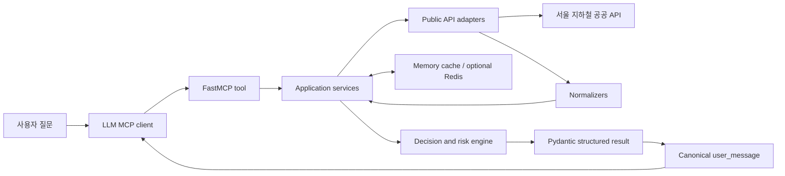

# Barrier-Free Mobility MCP 아키텍처

최종 검토일: 2026-07-15

이 문서는 Barrier-Free Mobility MCP의 제품 경계, 책임 분리, 데이터 흐름, 실패 처리와 주요
설계 결정을 설명합니다. 설치·실행 방법은 [README](../README.md)를 참고합니다.

## 설계 목표

- 여러 서울 지하철 공공 API를 하나의 접근성 판단으로 결합한다.
- 사용자의 이동 조건을 서버의 deterministic rule로 평가한다.
- 확인된 정보, 미확인 정보, 지원 범위 밖, 외부 API 실패를 구분한다.
- 일부 API가 실패해도 가능한 근거를 포함한 partial response를 반환한다.
- LLM client가 임의의 안전 판단을 만들지 않도록 canonical `user_message`를 제공한다.

다음은 목표가 아닙니다.

- 일반 지하철 길찾기 앱 대체
- 전체 무단차 동선 보장
- 서버 내부 LLM 호출
- 사용자 계정, 이동 기록, 추천 이력 관리
- 공식 근거가 없는 환승·출구 동선 추론

## 제품과 변경 원칙

일반 지하철 길찾기는 최단 시간과 환승 횟수를 제공하지만, 교통약자가 실제로 이동할 때
필요한 엘리베이터 위치·운행 상태, 환승·출구 동선, 장애인화장실 정보를 한 번에 판단하기
어렵습니다. 이 서버는 다음 세 가지를 분리해 제공하는 데 집중합니다.

1. 현재 데이터로 확인된 사실
2. 데이터만으로 확인하지 못한 시설과 동선
3. 필요한 경우 출발 전에 추가로 확인하면 좋은 사항

사용자 답변은 다음 원칙을 지킵니다.

- `안전하게 이동 가능합니다`, `문제 없습니다`, `반드시 이용 가능합니다`처럼 안전을
  보장하는 표현을 사용하지 않는다.
- 엘리베이터 존재와 필요한 전체 동선 연결을 같은 의미로 판단하지 않는다.
- 정상 빈 결과, API 실패, 지원 범위 밖을 서로 다르게 표현한다.
- `일부 역` 대신 가능한 경우 역명을 직접 표시한다.
- 표는 핵심역 비교에 도움이 될 때만 사용하고 색상이나 장식에 의미를 의존하지 않는다.
- 모호한 입력에는 한 번에 하나의 구체적인 추가 질문을 한다.

새 tool, API, schema 필드, 운영 인프라는 다음 조건을 모두 만족할 때만 추가합니다.

1. 해결할 사용자 문제 또는 운영 문제가 구체적이다.
2. 기존 기능으로 해결할 수 없는 이유가 있다.
3. 정상, 빈 결과, 부분 실패, 전체 실패 동작을 정의할 수 있다.
4. mock fixture와 회귀 테스트를 추가할 수 있다.
5. 기본 local 사용을 불필요하게 복잡하게 만들지 않는다.

## 전체 흐름



`answer_accessibility_question`의 대표 처리 순서는 다음과 같습니다.

1. 질문에서 intent, 역·호선, 이동 조건, 시설 요구를 해석한다.
2. 모호한 역이나 장소명은 한 번에 하나의 clarification question으로 반환한다.
3. 출발역과 도착역을 정규화하고 지원 범위를 확인한다.
4. 최단경로 API 후보를 조회한다.
5. 후보 경로의 출발·환승·도착역 시설을 조회한다.
6. raw response를 내부 Pydantic schema에 맞게 정규화한다.
7. mobility profile과 근거 상태를 deterministic engine에 전달한다.
8. 경로 후보별 위험도를 정렬하고 구조화된 근거를 만든다.
9. 같은 판단값으로 사용자용 Markdown `user_message`를 생성한다.

## 계층별 책임

| 계층 | 책임 | 포함하지 않는 책임 |
|---|---|---|
| `app/mcp` | tool, prompt, resource 등록과 transport 경계 | API 파싱, 위험도 계산 |
| `app/adapters` | 외부 HTTP 요청, 인증 parameter, raw response | business rule, 사용자 문장 |
| `app/normalizers` | 서로 다른 API 필드를 내부 schema로 변환 | route 선택, risk 판단 |
| `app/services` | adapter·normalizer·cache 조합, partial failure 처리 | 임의의 위험 점수 생성 |
| `app/engine` | mobility rule, risk scoring, route ranking | HTTP 호출, 응답 formatting |
| `app/schemas` | Pydantic v2 input/output 계약 | 외부 I/O orchestration |
| `app/cache` | memory/Redis TTL과 stale fallback | source별 business policy |

이 경계를 통해 공공 API 필드 변경은 normalizer와 fixture에서, 판단 정책 변경은 engine과
회귀 테스트에서 독립적으로 다룰 수 있습니다.

## 자연어 질문과 MCP tool

일반 사용자의 기본 진입점은 `answer_accessibility_question(question)`입니다.

- 경로 접근성 질문
- 역별 엘리베이터·장애인화장실 질문
- 공식 경로 후보 안에서의 대안 요청
- 모호한 역·호선·장소명 clarification

구조화 입력이 이미 있는 agent는 `generate_accessibility_brief`를 사용합니다.
`check_accessible_trip`과 개별 조회 tool은 검증, 근거 확인, 세부 조회를 위한 supporting tool입니다.

서버는 대화 기록을 저장하지 않습니다. “현재 경로”처럼 이전 대화가 필요한 질문은 LLM client가
출발역과 도착역을 다시 전달해야 합니다.

## 역·호선 지원 범위

지원 여부는 하나의 목록을 복사해 관리하지 않고 다음 registry를 조합해 계산합니다.

| Registry | 역할 |
|---|---|
| `app/data/station_aliases.yaml` | 역명, 호선, 별칭, 운영기관 |
| `app/data/route_station_codes.yaml` | 최단경로 API에서 검증된 전용 역 코드 |
| `app/data/source_coverage.yaml` | 접근성 source별 운영기관 지원 범위 |

판정 상태는 다음과 같습니다.

- `SUPPORTED`: 역·호선 등록, 경로 API 코드, 핵심 접근성 source가 모두 확인됨
- `PARTIAL`: 역은 인식하지만 경로 코드 또는 source coverage가 일부 부족함
- `UNVERIFIED`: 현재 검증된 역·호선 registry에서 확정하지 못함

부분 지원은 곧 실패를 의미하지 않습니다. 가능한 조회 결과를 반환하되 `limitations`와
사용자 답변에 검증되지 않은 범위를 표시합니다. 미검증 역은 유사 역으로 임의 확정하지 않습니다.

## 경로 API 역 코드 분리

일반 station id와 최단경로 API가 받는 역 코드는 같은 값이라고 가정하지 않습니다.
최단경로 API는 `route_station_codes.yaml`에서 실제 응답으로 검증한 코드만 사용합니다.

이 결정은 이름 기반 조회가 환승역의 다른 호선을 선택하거나 직행 경로 대신 비정상 환승 경로를
반환한 문제를 재현한 뒤 도입했습니다.

처리 규칙:

1. 출발·도착 역과 호선 모두에 검증된 route code가 있으면 code 방식으로 조회한다.
2. 한쪽이라도 검증되지 않았다면 이름 조회로 fallback한다.
3. 이름 fallback 사실은 지원 범위 limitation으로 남긴다.
4. 입력 호선과 일치하지 않는 경로 후보는 선택 대상에서 제외한다.
5. route code와 일반 station id를 서로 대체하지 않는다.

## 접근성 근거 모델

역에 엘리베이터가 존재한다는 사실만으로 전체 동선이 연결됐다고 판단하지 않습니다.
`AccessibilityCheck`는 다음 근거를 분리합니다.

- 역 내 엘리베이터 설치 확인
- 요청 호선과 시설 호선 일치
- 현재 운행 상태 확인
- 승강장→대합실 동선 확인
- 환승 동선 확인
- 대합실→출구 동선 확인

각 근거는 `CONFIRMED`, `UNVERIFIED`, `NOT_APPLICABLE`, `FAILED` 중 하나입니다. 공공데이터가
제공하지 않는 동선은 시설명이나 층 표기를 이용해 임의 추론하지 않고 `UNVERIFIED`로 유지합니다.

## Deterministic risk engine

위험도는 LLM이 생성하지 않습니다. `app/engine`이 YAML rule과 구조화 근거를 사용해 계산합니다.

- 점수는 0~100으로 제한한다.
- rule별 score와 message를 함께 기록한다.
- critical source 실패는 `UNKNOWN`을 우선한다.
- 엘리베이터 필수 조건에서 핵심 동선이 미확인이면 최소 `CAUTION`으로 정렬한다.
- `risk_level`, `risk_score`, 사용자 판단 문구가 충돌하지 않도록 alignment 단계를 거친다.
- 모든 공식 경로 후보에 같은 평가를 적용한 뒤 접근성 위험, 환승, 이동 시간 순으로 비교한다.

`risk_level`은 안전 보장이 아니라 현재 데이터 기준의 주의 수준입니다.

## 실패와 fallback

외부 API 실패는 가능한 경우 MCP tool 전체 exception으로 전파하지 않습니다.

```text
fresh API
  -> fresh cache
  -> 허용 기간 내 stale cache + warning
  -> 정적 시설 정보
  -> partial response
```

응답은 다음 상태를 구분합니다.

- 정상 데이터 있음
- 정상 조회 후 빈 결과
- 일부 source 실패
- 전체 source 실패
- 데이터 제공 범위 밖
- stale fallback 사용

`failed_sources`, `limitations`, `data_sources`와 조회 시각은 사용자 답변과 구조화 결과에 함께
전달됩니다. API key, bearer token, endpoint parameter는 포함하지 않습니다.

## Cache와 운영 기능

memory cache가 기본값입니다. 단일 local process와 초기 hosted pilot에는 충분합니다.
Redis는 여러 instance가 cache를 공유해야 할 때만 선택합니다.

- fresh TTL과 stale fallback 기간을 분리한다.
- cache 응답도 원본 API 조회 시각을 유지한다.
- 동일 key의 동시 miss는 single-flight로 합친다.
- Redis 장애는 cache miss로 처리하고 health를 degraded로 표시한다.

인증도 local critical path에서 분리합니다.

- `none`: local mock/live 개발
- `static`: 제한된 외부 테스트
- `oidc`: 실제 hosted 사용자 인증 요구가 생긴 경우

현재 hosted 설정 파일은 `deploy/hosted`에 예시로만 유지합니다. 실제 endpoint를 배포한 뒤
검증된 provider, HTTPS, 인증 절차를 별도 runbook으로 기록합니다.

## 사용자 답변 계약

`user_message`는 일반 사용자에게 그대로 보여줄 canonical answer입니다.

1. 현재 확인된 핵심 결론
2. 필요할 때만 권장 확인 사항
3. 출발·환승·도착역별 확인과 미확인 근거
4. 출처별 조회 시각
5. 짧은 주의사항

LLM client는 구조화 근거를 추가 설명에 사용할 수 있지만 별도의 안전 판단을 만들면 안 됩니다.
MCP 서버는 외부 LLM 발화를 완전히 강제할 수 없으므로 tool description, prompt, resource와
schema description에 같은 정책을 반복합니다.

## 검증 경계

자동 테스트는 normalizer, risk engine, partial failure, MCP tool, canonical answer를 검증합니다.
live 평가 도구는 실제 공공 API의 지연, source 실패, payload와 답변 형식을 확인합니다.
FastMCP Client와 MCP Python SDK 검사는 protocol 계약을 확인합니다.

ChatGPT, Claude, Gemini 제품 UI의 tool 선택, Markdown rendering과 최종 문장 재작성은 별도의
end-to-end 검증 대상입니다. 자세한 절차는 [검증 가이드](validation.md)를 참고합니다.
